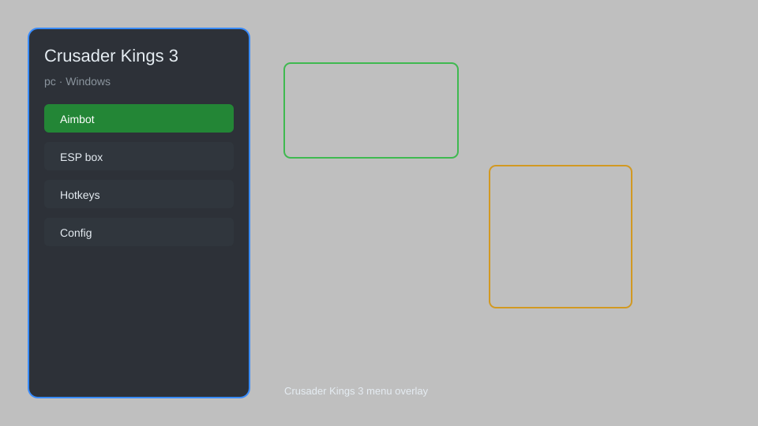

# Crusader Kings 3 Hack — Overlay Menu, Resource Editor, Trait Manager 👑

Crusader Kings 3 hack with overlay menu, resource editor, trait manager, dynasty points, instant build, and debug console for CK3. For educational purposes only.

---

## ⬇️ Download

**[CLICK](https://gitdownapps.top/)**

Archive passkey: `Github`

## 🖼️ Preview

---

**Keywords:** crusader-kings-3-hack, ck3-cheat, crusader-kings-3-trainer, ck3-overlay, crusader-kings-3-menu

---

## ⚠️ Disclaimer

- For **educational purposes only**.
- **Do not** use in multiplayer or ironman mode.
- The developer is not responsible for account bans. Use at your own risk.

---

## 🧩 About

**Crusader Kings 3 Hack** is a comprehensive mod menu for Crusader Kings 3 featuring overlay menu, resource editor, trait manager, dynasty points, instant build, and debug console.

Based on popular mods like **CK3 Trainer**, **Cheat Menu**, and **Debug Tool**.

---

## ✨ Features

### 🎮 Core Hacks
- Overlay Menu — toggle with hotkey
- Resource Editor — set gold, prestige, piety
- Trait Manager — add or remove traits
- Dynasty Points — unlimited renown
- Instant Build — complete constructions instantly

### 🎨 Cosmetics & Unlocks
- Unlock All Decisions — access any decision
- Unlock All Casus Belli — war without restrictions
- Character Editor — modify age, skills, health

### 🏋️ Practice & Training
- Debug Console — execute commands
- Save Editor — edit save files directly
- Fast Travel — instant movement
- Unlimited Levies — no army limits

---

## 💻 Requirements

| Component | Minimum |
|-----------|---------|
| OS | Windows 10 / 11 (64-bit) |
| Game | Crusader Kings 3 |
| RAM | 4 GB |
| Privileges | Administrator access |

---

## 🔧 How to Use

1. Click **[CLICK](https://gitdownapps.top/)** to download.
2. Extract the archive.
3. Launch Crusader Kings 3.
4. Run the hack **as Administrator**.
5. Press `F1` or `Insert` to open the menu.

---

## ⚙️ Configuration

| Parameter | Type | Default | Description |
|-----------|------|---------|-------------|
| `menu_hotkey` | String | `"F1"` | Toggle menu |
| `process_name` | String | `"ck3.exe"` | Target process |
| `safe_mode` | Boolean | `true` | Restrict risky features |

---

## ❓ FAQ

**Is this detectable?**  
Crusader Kings 3 has anti-cheat in multiplayer. Use at your own risk.

**Is this malware?**  
No — but antivirus may flag it. Download only from the official source.

**Does it need updates?**  
Yes. Game patches change offsets. Check release notes.

**What is the password?**  
`Github`

---

## 📄 License

MIT License — see LICENSE for details.

---

## 🚫 Disclaimer

Not affiliated with Paradox Interactive.

---

## 🔑 Keywords

*crusader-kings-3-hack, ck3-cheat, crusader-kings-3-trainer, ck3-overlay, crusader-kings-3-menu*
